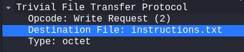

# Trivial Falg Transfer Protocol

This is the last CTF in the picoCTF Forensics playlist, available [here](https://play.picoctf.org/playlists/16?m=130). It gives us a packet capture file called `tftp.pcapng`. I am opening this file via wireshark.

---

On a first glance, this capture contains information of 152413 packets. Almost all of these packets are of a protocol called **TFTP** (trivial file transfer protocol). I've not used this before, so I'll look up its format.

Other than TFTP, there are a few ARP and SSDP packets, small in number (tot. 18) to be manually checked.

I did not find any useful information in the non TFTP packets.

---

I have now studied the TFPT protocol to some extent from [wikipedia](https://en.wikipedia.org/wiki/Trivial_File_Transfer_Protocol). It is a basic version of FTP. It only supports reading a remote file and writing to a remote file, without any authentication stuff whatsoever. It works on UDP.

This is good for my purposes here, as there is very less complexity.

---

I filtered out the non - TFTP packets, and judging by the first packet's body:

It seems that this `instructions.txt` file is what I'm after. Now to figure out a way to extract it. At this point, I think that the contents of the file are in the UDP stream of this packet.

---

The packet says that the `octet` type of transfer was performed. According to wikipedia:

> "Octet allows for the transfer of arbitrary raw 8-bit bytes, with the received file resulting byte-per-byte identical to the one sent. More correctly, if a host receives an octet file and then returns it, the returned file must be identical to the original."

This means I need to extract the bytes and re-assemble them together into the resultant file.

---

Ok, I have now used the _File -> Export Objects -> TFTP_ option from the wireshark menu, apparently there were quite a few files in the transfer:

